# 欢迎使用DevPilot: 您的程序伙伴助您成为更出色的开发者

[English](README.md) | [中文](README_ZH.md)

## 立即体验

使用DevPilot,这个为IntelliJ IDEA专门设计的新型编程伙伴,释放AI在您编程中的强大力量。

这个创新的基于AI的插件将会提升您的开发流程。

## 卓越特性

1. **智能代码建议:** 结束编程难点! DevPilot 在你编辑时实时提供代码建议,理解您的上下文并给出精准的建议。

2. **主动错误检测:** 避免错误! DevPilot 在错误出现前发现潜在的bug和错误,提供明智的解决方案和替代方法来编写高效、无错误的代码。

3. **代码重构:** 提升您的代码! DevPilot 帮助优化代码,提供见解告诉您如何重构和提高代码的结构和性能。

4. **单元测试生成:** 测试变简单! DevPilot 可以为您生成单元测试代码,确保您的代码不仅可以按预期工作,而且也准备好应对任何未来的更改。

5. **代码解释:** 不仅编写代码,还要理解它! DevPilot 可以解释不熟悉的代码段,帮助您更快地掌握发生的事情并学习。

6. **自动添加注释:** 保持代码清晰易读! DevPilot 可以自动为您的代码添加注释,确保它易于理解和维护。

## 安装插件

目前插件对于idea的版本有要求，最低版本要求为2021.2，建议版本为2022.1以上。

安装插件有两个渠道：

idea官方市场 - 目前内测阶段暂时未上架，后续release正式版本后会上架到市场
压缩包安装 - 在plugin页面选择设置中的从磁盘安装，之后将zip包导入即可，压缩包下载地址：下载

## 配置插件

插件安装成功后，在idea设置页面的Tools中就能找到DevPilot的配置页面

在配置页面可以切换插件的中英文，以及选择不同模型和模型的地址，用户名则是在对话时在页面展示时使用。
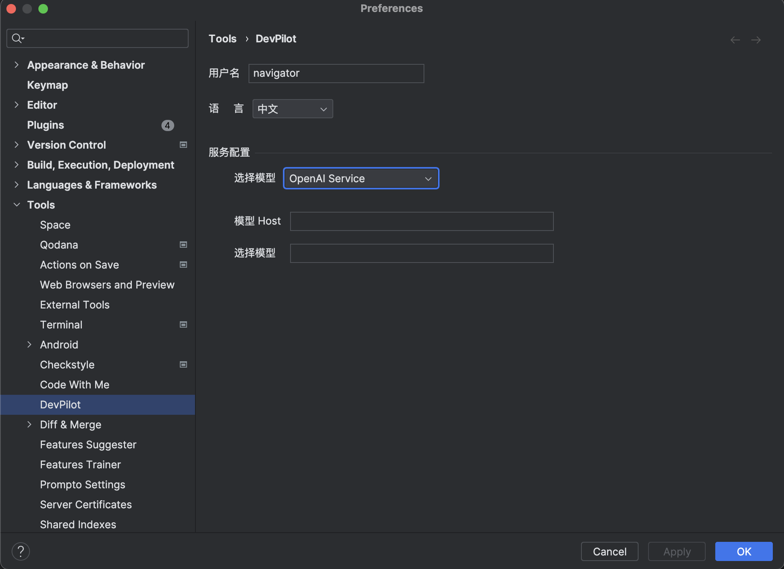

## 插件功能

DevPilot为开发者提供了丰富的能力来协助开发者能够省去繁琐的测试用例和注释编写，也能够帮助开发者编写更加高效的代码，同时也能帮助排查代码的问题等等。

### 生成式AI对话

插件支持对话能力，通过右键或者是右边侧边栏的入口可以打开对话的页面

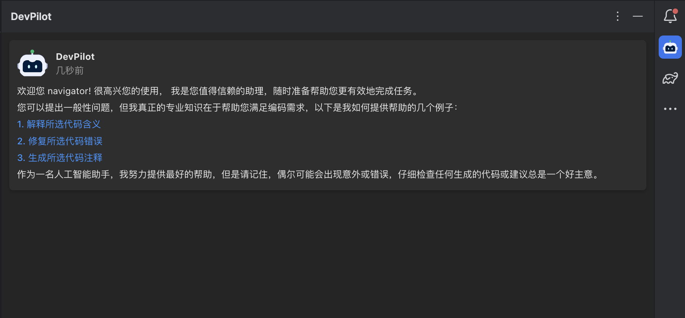

在对话框中可以编写问题，通过回车或者是发送按钮进行聊天问题的发送，后续OpenAI会返回回答并在当前页面输出

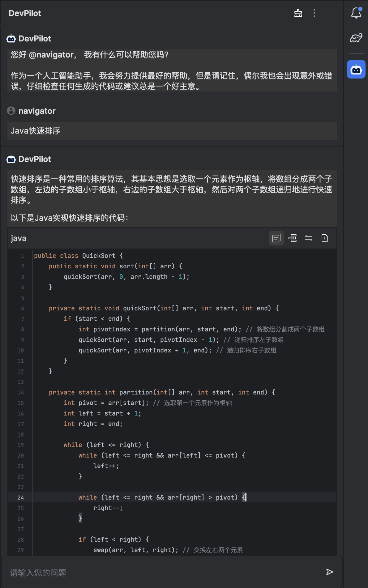

### 生成测试用例

用户可以通过我们插件来生成测试用例。用户选中某个方法右键点击Generate Tests

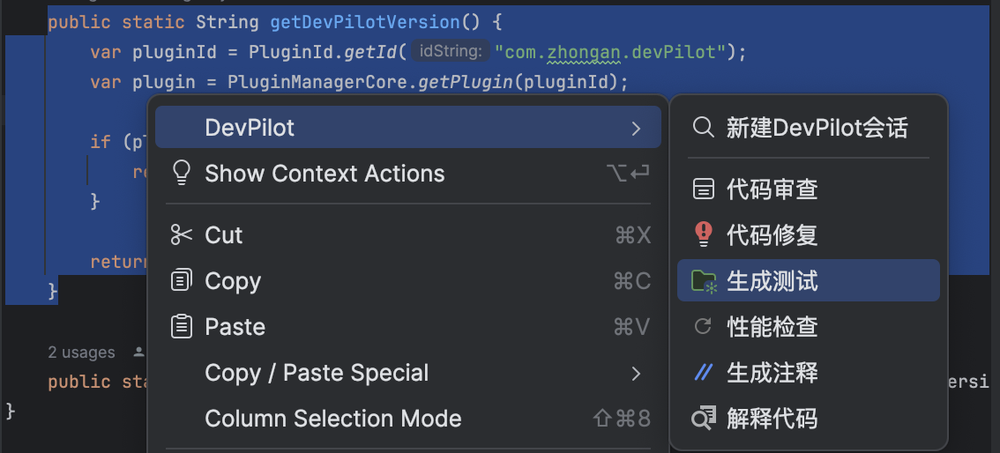

之后窗口会自动打开然后窗口会返回相关的测试用例，用户可以直接复制测试，或者直接选择在光标处插入或者替换相关的代码，甚至还可以新建测试类文件

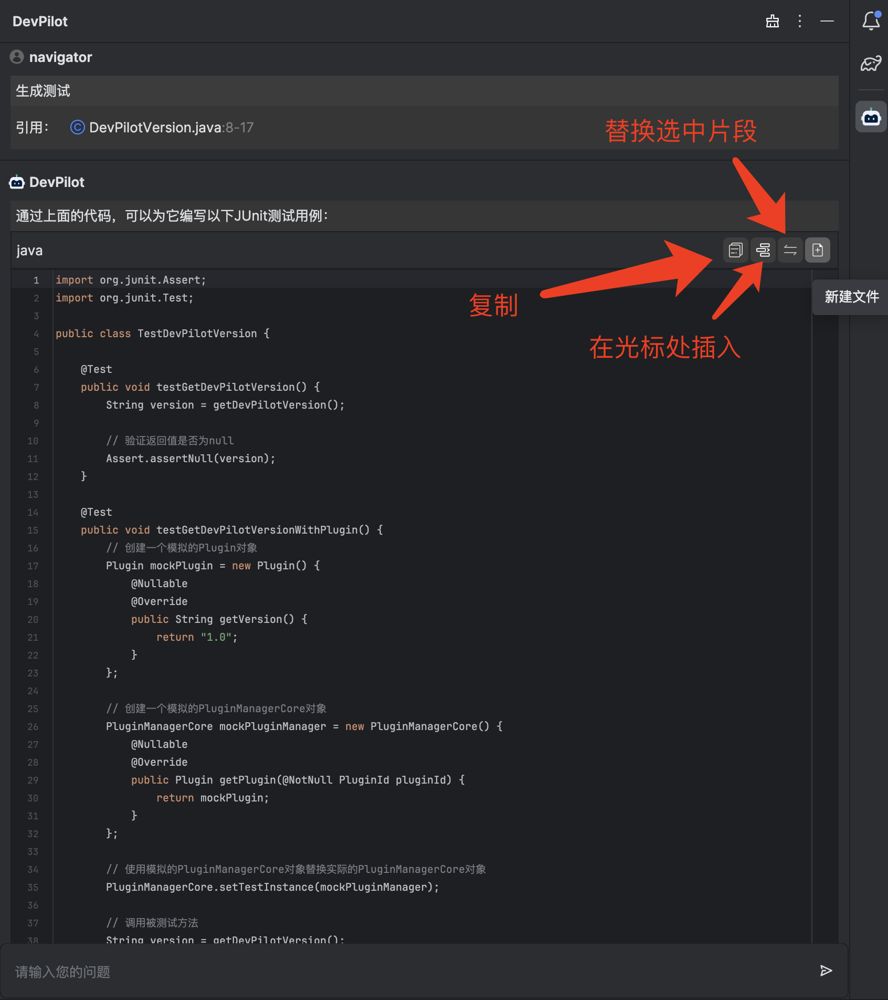

### 生成注释

插件支持代码注释的生成功能。用户选中代码块后右键点击Generate comments

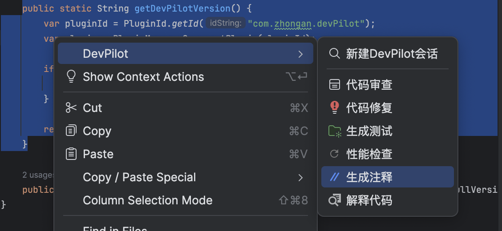

之后窗口自动打开会返回相关的注释结果，并且在编辑器中会自动将生成注释后的结果和原先的代码进行diff，用户可以自行进行比对接受对应的注释。

### 修复代码

插件支持修复代码的能力。用户选中代码块后右键点击Fix This

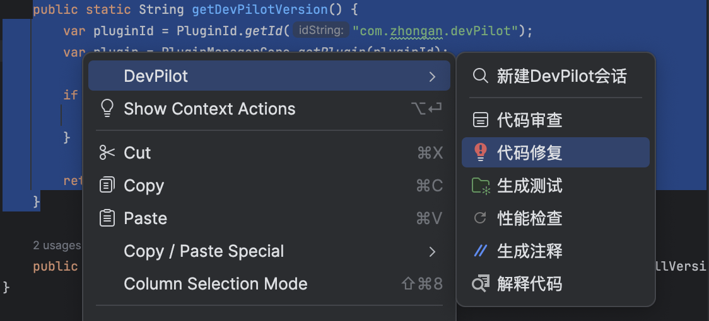

之后窗口自动打开会返回相关的修复建议，用户可以根据建议修改代码

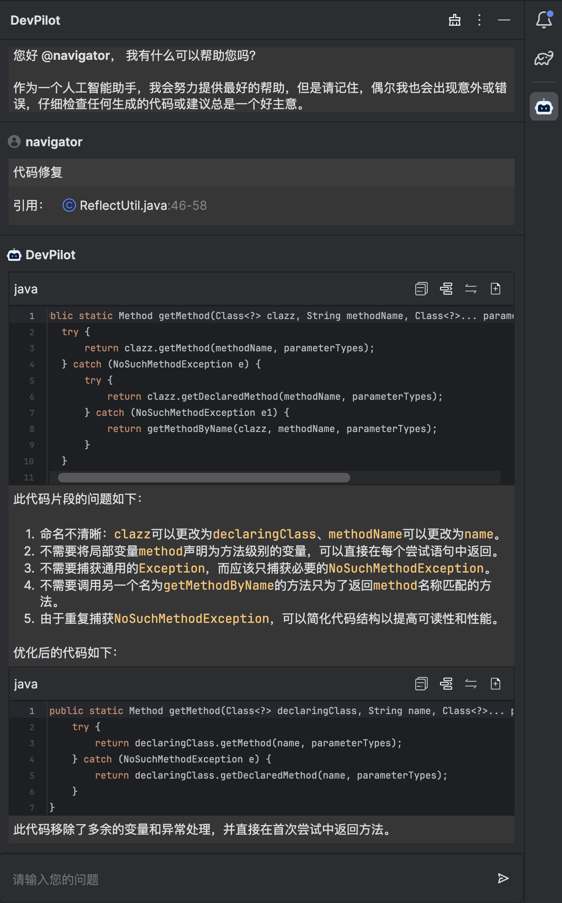

### Review 代码

插件支持review代码的能力。用户选中代码块后右键点击Review Code

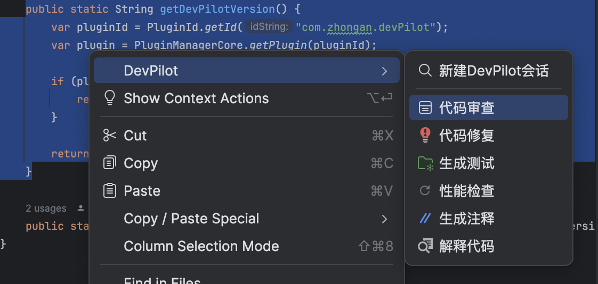

之后窗口自动打开会返回相关的review结果，用户可以根据结果来编辑自己的代码逻辑

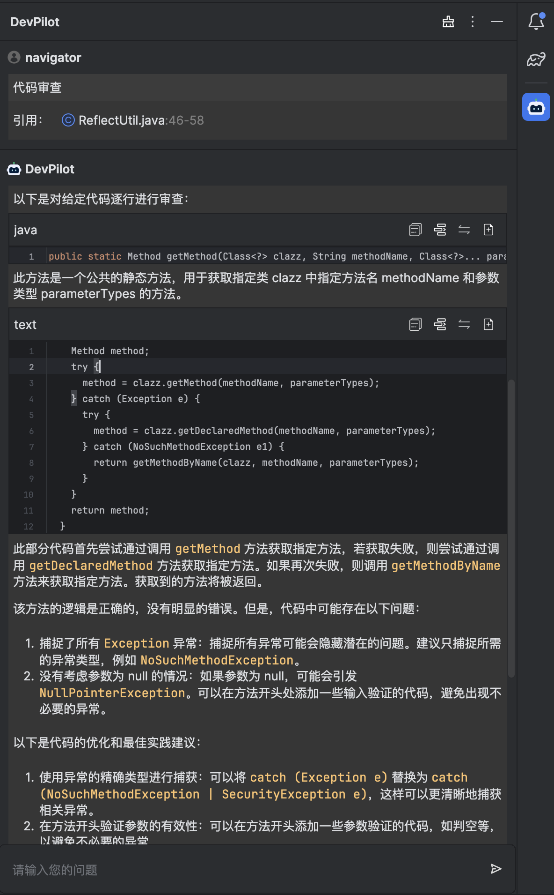

### 性能检测

插件支持对代码进行性能检测。用户选中代码块后右键点击Performance Check

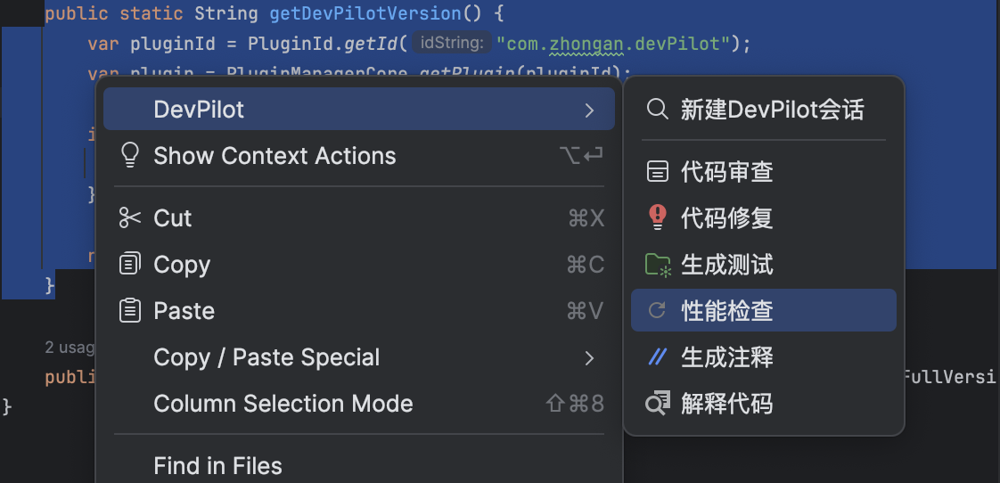

之后窗口自动打开会返回相关的性能检测结果，并且在编辑器中会自动将代码优化后的结果和原先的代码进行diff，用户可以根据结果来优化代码

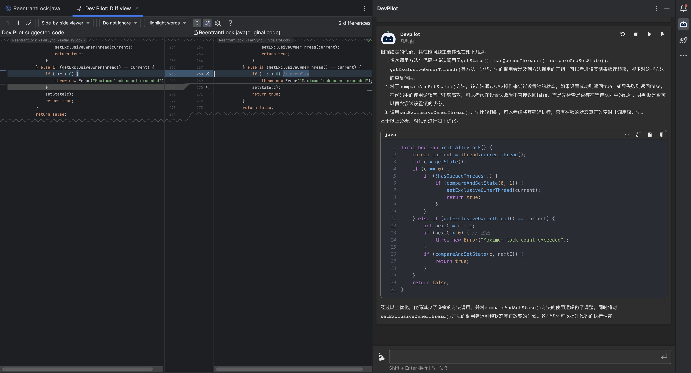

### 清理缓存

插件整体的相关能力都是附带上下文的，但是上下文可能会存在污染这种情况，并且OpenAI或者是其他的大模型都可能会存在token的限制，超出限制会进行报错。因此我们提供清理的能力，在窗口右上角点击清除按钮就可以将当前会话全部清空。

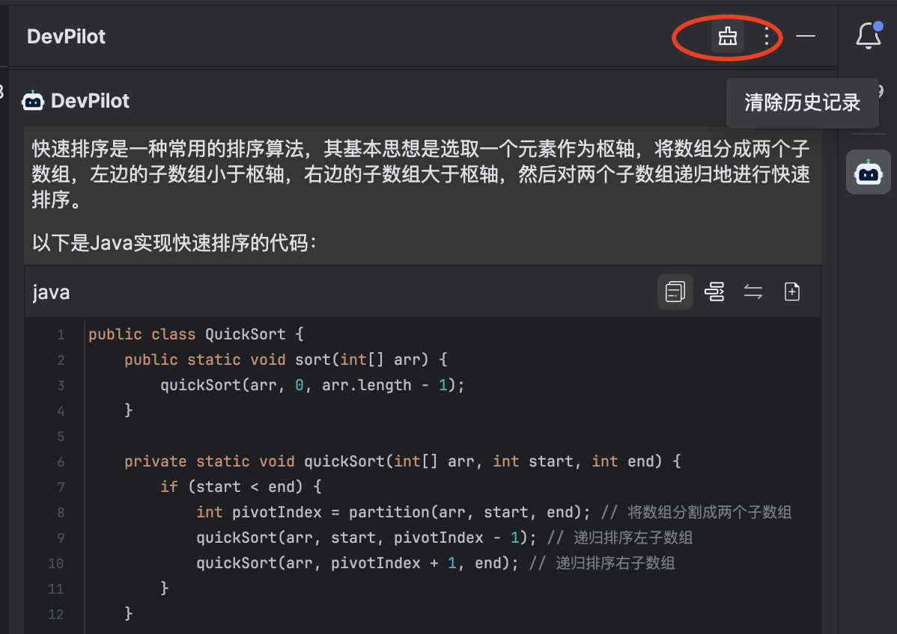

## 路线图

在DevPilot,我们一直在不断扩展我们AI驱动的插件的功能,以满足用户不断变化的需求。我们的路线图反映了我们对不断改进和创新的承诺。

### 近期目标:与本地LLM集成

我们很快将支持将Codellama(这是Meta开发的一个开源LLM)集成到DevPilot中。这将使您能够在本地开发环境中利用LLM的力量,而无需将任何敏感数据发送给OpenAI。

通过Codellama集成,用户可以期待:

- 更准确、与上下文相关的代码建议,Codellama具有10万个上下文长度,因此它提供的建议将基于对代码上下文的更深入理解。这将显著减少开发人员在弄清楚适当代码要使用的时间。
- 通过在大规模代码库上进行微调,在某些情况下,Codellama可以胜过ChatGPT。

Codellama的使用,请参阅[将Codellama部署到您的本地环境](https://github.com/openpilot-hub/codellama-deploy)。

### 长期目标:模型即服务(MaaS)支持

展望未来,我们计划通过支持模型即服务(MaaS)进一步扩展我们的功能。MaaS提供了以服务为基础的方式利用AI模型的功能,而无需本地部署或维护。此功能将使最新的AI模型可无缝访问,而无需承担计算成本或在本地管理这些模型的复杂性。

通过将MaaS集成到DevPilot中,我们旨在:

- 无需设置OpenAI API密钥即可访问最新的OpenAI模型。
- 提供即插即用的解决方案来访问最先进的AI模型。
- 让开发人员在无需本地资源的情况下利用最新的AI进步。
- 提供可随着项目需求增长而扩展的解决方案。

## 贡献

更多信息请查看 [CONTRIBUTING_ZH.md](CONTRIBUTING_ZH.md)。

## 联系我们

如果有任何问题或建议,请通过电子邮件联系我们 [pilot_group@zhongan.com](mailto:pilot_group@zhongan.com)。
